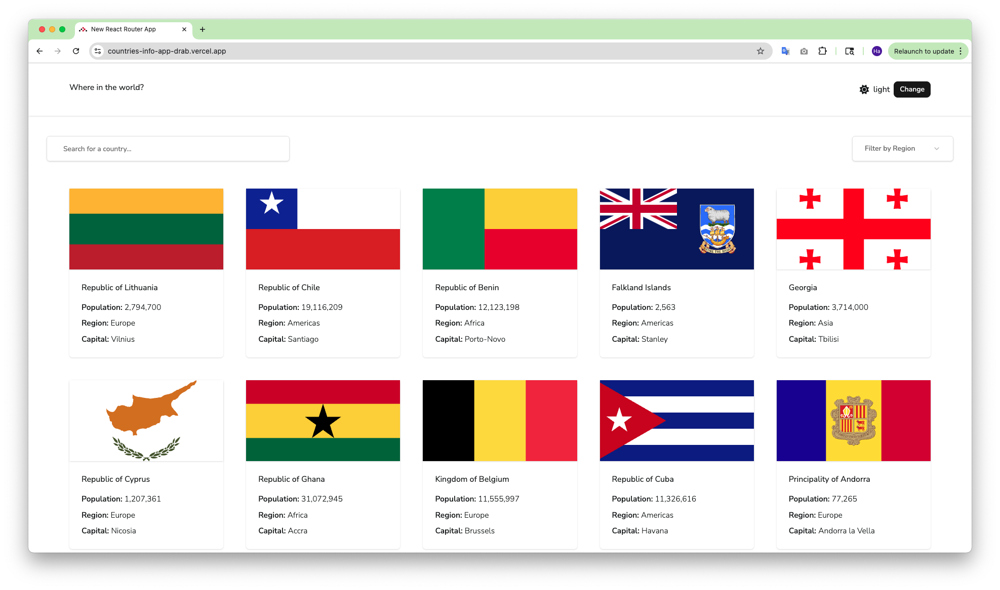

REST Countries API with color theme switcher
https://www.frontendmentor.io/challenges/rest-countries-api-with-color-theme-switcher-5cacc469fec04111f7b848ca
advanced/countries-info-app

# Frontend Mentor - REST Countries API with color theme switcher solution

This is a solution to the [REST Countries API with color theme switcher challenge on Frontend Mentor](https://www.frontendmentor.io/challenges/rest-countries-api-with-color-theme-switcher-5cacc469fec04111f7b848ca). Frontend Mentor challenges help you improve your coding skills by building realistic projects.

## Table of contents

- [Overview](#overview)
  - [The challenge](#the-challenge)
  - [Screenshot](#screenshot)
  - [Links](#links)
- [My process](#my-process)
  - [Built with](#built-with)
  - [What I learned](#what-i-learned)
- [Author](#author)

## Overview

### The challenge

Your challenge is to integrate with the [REST Countries API](https://restcountries.com) to pull country data and display it like in the designs.

You can use any JavaScript framework/library on the front-end such as [React](https://reactjs.org) or [Vue](https://vuejs.org). You also have complete control over which packages you use to do things like make HTTP requests or style your project.

Your users should be able to:

- See all countries from the API on the homepage
- Search for a country using an `input` field
- Filter countries by region
- Click on a country to see more detailed information on a separate page
- Click through to the border countries on the detail page
- Toggle the color scheme between light and dark mode _(optional)_

### Screenshot

**Mobile**

&nbsp;&nbsp;&nbsp;&nbsp;&nbsp;&nbsp;&nbsp;&nbsp;&nbsp;&nbsp;


**Tablet**

&nbsp;&nbsp;&nbsp;&nbsp;&nbsp;&nbsp;&nbsp;&nbsp;&nbsp;&nbsp;


**Desktop**

&nbsp;&nbsp;&nbsp;&nbsp;&nbsp;&nbsp;&nbsp;&nbsp;&nbsp;&nbsp;


### Links

- Solution URL: https://github.com/hatran-hattt/frontendmentor/tree/master/advanced/countries-info-app
- Live Site URL: https://countries-info-app-drab.vercel.app/

## My process

### Built with

- Semantic HTML5 markup
- CSS custom properties
- CSS Grid, Flexbox
- Mobile-first workflow
- React.js, TypeScript
- Libraries: TailwindCSS, React hook form, Zod, Shadcn UI
- Framework: **React Router** (Framework mode)

### What I learned

I've learned using React Router (Framework mode), UI Tips throughout this challenge

1. URL structure

```
  https://yourapp.com/products/laptops?category=tech&sort=price_asc
                         |                       |
                         |                       +--- Search Parameter (Optional, Modifies View)
                         |
                         +--------------------------- Path Segment (Required, Identifies Resource)
```

- `Path Segments (Route Parameters)`
  - Ex: `/posts/123`
  - Are `required` parts of the URL's path structure that are essential for `identifying` a specific resource or page.
  - Usage:
    - Define in route path (/products/:productId)
      (`:productId`: using colon(:) to define dynamic segment)
    - Get dynamic segments: using `useParams()` hook within component

- `Search Parameters (Query String)`
  - Ex: `/posts?sort=date`
  - Are `optional` key-value pairs appended to the URL after a question mark (?). They are used to `filter, sort, or modify the view of the resource` identified by the path.
  - Usage:
    - Define: NO NEED define in route path
    - Get: using `useSearchParams()` hook within component

2.  [Root Route](https://reactrouter.com/api/framework-conventions/root.tsx)
    - app/root.tsx is parent to all routes and is in charge of rendering the root <html> document
    - Layout: takes a single children prop, which is the default export (e.g. App), HydrateFallback (), or ErrorBoundary.
      - HydrateFallback: On initial page load, the route component renders only after the `client loader` is finished. If exported, a HydrateFallback can render immediately in place of the route component.
      - ErrorBoundary: When other route module APIs throw, the route module ErrorBoundary will render instead of the route component.

3.  [Navigating](https://reactrouter.com/start/framework/navigating)
    Navigate application with:
    - `<Link>`: when the link doesn't need active styling
    - `<NavLink>`: when the link need render active and pending states
    - `<Form>`: ...
    - `redirect`: ...
    - `useNavigate`: navigate the user to a new page without the user interacting (uncommon case)
      TIPS: handle custom back button: let navigate = useNavigate(); navigate(-1)

4.  [Emulates the browser's scroll restoration on location changes](https://reactrouter.com/api/components/ScrollRestoration)

    ```
        <ScrollRestoration
          getKey={(location, matches) => {
            // Restore based on a unique location key (default behavior)
            return location.key

              // Restore based on pathname <= Used for this challenge
              return location.pathname

          }}
        />
    ```

5.  Handle toggle theme
    Handle these when change theme:

        - Save selected theme to localStorage
        - Add coresponding class to root element ("dark", "light")

    Reference: [Shadcn UI theme toggle](https://ui.shadcn.com/docs/dark-mode/vite#add-a-mode-toggle)

## Author

- Frontend Mentor - [@hatran-hattt](https://www.frontendmentor.io/profile/hatran-hattt)
