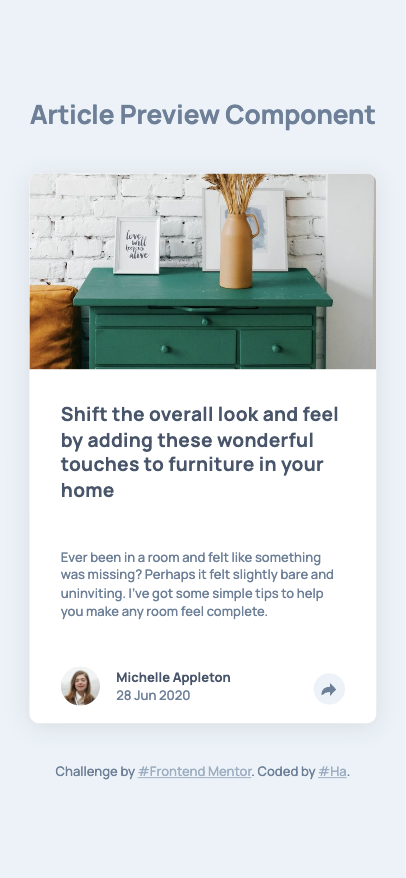
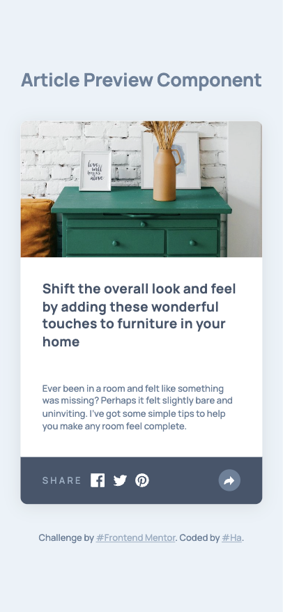
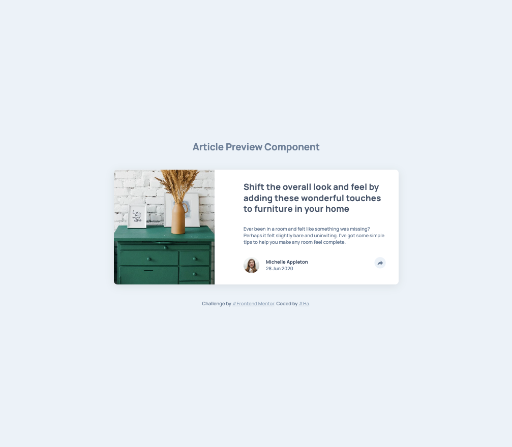
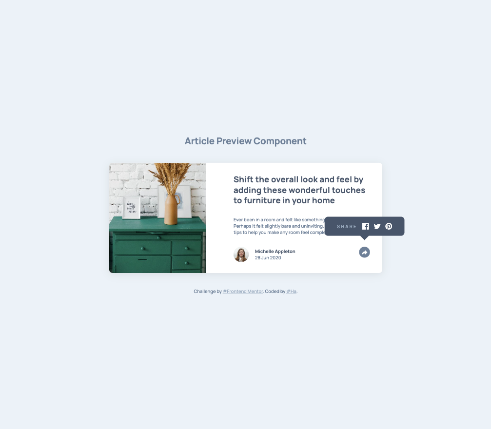

# Frontend Mentor - Article preview component solution

This is a solution to the [Article preview component challenge on Frontend Mentor](https://www.frontendmentor.io/challenges/article-preview-component-dYBN_pYFT). Frontend Mentor challenges help you improve your coding skills by building realistic projects.

## Table of contents

- [Overview](#overview)
  - [The challenge](#the-challenge)
  - [Screenshot](#screenshot)
  - [Links](#links)
- [My process](#my-process)
  - [Built with](#built-with)
  - [What I learned](#what-i-learned)
- [Author](#author)

## Overview

### The challenge

Users should be able to:

- View the optimal layout for the component depending on their device's screen size
- See the social media share links when they click the share icon

### Screenshot

**Mobile**

&nbsp;&nbsp;&nbsp;&nbsp;&nbsp;&nbsp;&nbsp;&nbsp;&nbsp;&nbsp;

&nbsp;&nbsp;&nbsp;&nbsp;&nbsp;&nbsp;&nbsp;&nbsp;&nbsp;&nbsp;

**Desktop**

&nbsp;&nbsp;&nbsp;&nbsp;&nbsp;&nbsp;&nbsp;&nbsp;&nbsp;&nbsp;

&nbsp;&nbsp;&nbsp;&nbsp;&nbsp;&nbsp;&nbsp;&nbsp;&nbsp;&nbsp;

### Links

- Solution URL: https://github.com/hatran-hattt/frontendmentor/tree/master/junior/article-preview-component
- Live Site URL: https://hatran-hattt.github.io/frontendmentor/junior/article-preview-component/index.html

## My process

### Built with

HTML, CSS, JS

- Semantic HTML5 markup
- CSS custom properties
- CSS layout: grid, flexbox, positioning
- Sass (CSS extension language)
- JS

### What I learned

- Placing related elements using CSS layout positioning.
- Using JS DOM to retrieve, assign event listeners, manipulate elements.

## Author

- Frontend Mentor - [@hatran-hattt](https://www.frontendmentor.io/profile/hatran-hattt)
