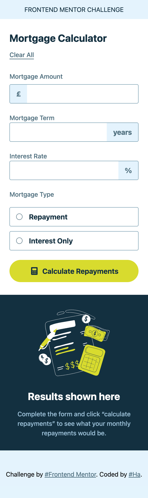
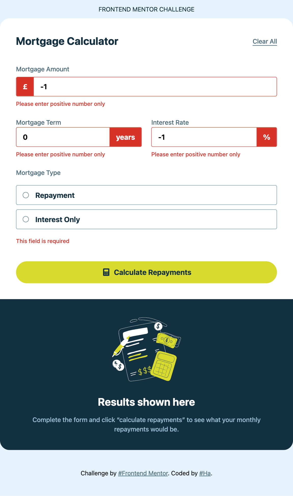
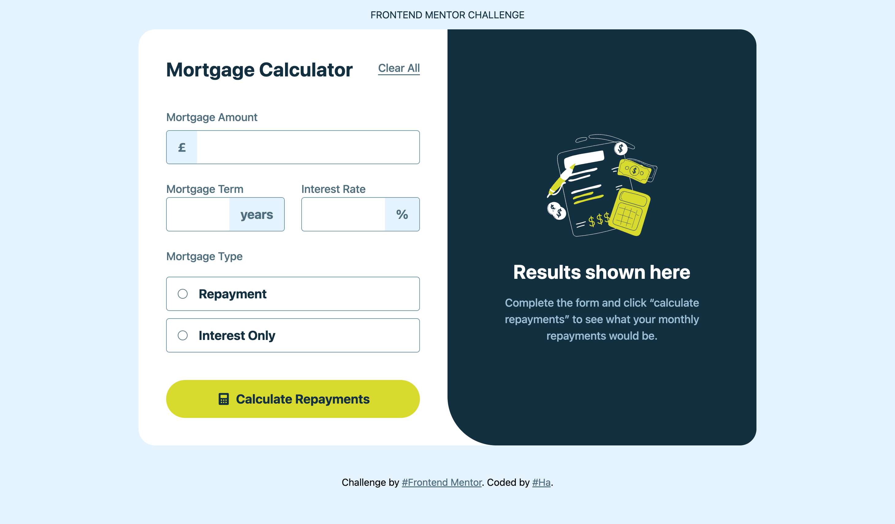

# Frontend Mentor - Mortgage repayment calculator solution

This is a solution to the [Mortgage repayment calculator challenge on Frontend Mentor](https://www.frontendmentor.io/challenges/mortgage-repayment-calculator-Galx1LXK73). Frontend Mentor challenges help you improve your coding skills by building realistic projects.

## Table of contents

- [Overview](#overview)
  - [The challenge](#the-challenge)
  - [Screenshot](#screenshot)
  - [Links](#links)
- [My process](#my-process)
  - [Built with](#built-with)
  - [What I learned](#what-i-learned)
- [Author](#author)

## Overview

### The challenge

Users should be able to:

- Input mortgage information and see monthly repayment and total repayment amounts after submitting the form
- See form validation messages if any field is incomplete
- Complete the form only using their keyboard
- View the optimal layout for the interface depending on their device's screen size
- See hover and focus states for all interactive elements on the page

### Screenshot

**Mobile**

&nbsp;&nbsp;&nbsp;&nbsp;&nbsp;&nbsp;&nbsp;&nbsp;&nbsp;&nbsp;


**Tablet**

&nbsp;&nbsp;&nbsp;&nbsp;&nbsp;&nbsp;&nbsp;&nbsp;&nbsp;&nbsp;


**Desktop**

&nbsp;&nbsp;&nbsp;&nbsp;&nbsp;&nbsp;&nbsp;&nbsp;&nbsp;&nbsp;


### Links

- Solution URL: https://github.com/hatran-hattt/frontendmentor/tree/master/junior/mortgage-repayment-calculator
- Live Site URL: https://hatran-hattt.github.io/frontendmentor/junior/mortgage-repayment-calculator/dist/index.html

## My process

### Built with

- Semantic HTML5 markup
- CSS custom properties
- CSS Grid, Flexbox
- Mobile-first workflow
- React.js, TypeScript
- Libraries: TailwindCSS, React hook form, Zod, Shadcn UI

### What I learned

I've learned libraries (Shadcn UI) and tips throughout this challenge

#### 1. Shadcn UI

Headless UI libraries. They come without styling, but with all the functionalities and accessibilities that a modern component library needs

Setup: https://ui.shadcn.com/docs/installation/vite

Conponents used in this challenge: form, label, input, radio group, button, separator

TIPS: Solution to reset selection of RadioGroup when controlled state is reseted: `value={field.value as string ?? ""}`

#### 2. CSS Tips:

- :focus and :focus-within are both CSS pseudo-classes used to style elements based on their focus state, but they target different elements.

:focus targets the currently focused element itself. It's used to style an input, button, or link directly when a user interacts with it (e.g., clicks on it or tabs to it).

:focus-within targets a parent element that contains a focused child. It's used to style a container when any element inside it, like an input field, has focus. This is particularly useful for creating a border or a highlight effect around an entire group of related form fields.

- Tailwind `peer-*`, `has-*`, `arbitrary []` variants

  - `peer-*`: styles a sibling element that follows the peer.
    (only apply to siblings that come after the peer element in the DOM (not reversible))
    ```
      <div class="flex">
        <input type="text" class="peer" />  -> target
        <span class="peer-focus:text-white">12345</span> -> Style for sibling that come after target
      </div>
    ```
  - `has-*`: styles a parent element or a sibling that precedes it (check descendant)

    ```
      <div class="flex has-[input:focus]:bg-red-500">  -> Style for target's parent
        <span class="has-[+input:focus]:text-white">12345</span>. -> Style for sibling that come before target (using adjacent Sibling Selector(+))
        <input type="text" /> -> target
      </div>
    ```

  - arbitrary variant

    ```

      <div class="flex has-[input:focus]:[&>span]:text-white"> ->  use the has selector on a common parent and then use a direct descendant selector ([&>span]: arbitrary variant) to apply the style to the span
        <span>12345</span>.
        <input type="text" />
      </div>
    ```

- CSS sibling selectors
  - Adjacent Sibling Selector (+)
    ```
      selector1 + selector2 {
          /* Styles applied to selector2 if it immediately follows selector1 */
      }
    ```
  - General Sibling Selector (~)
    ```
      selector1 ~ selector2 {
          /* Styles applied to all selector2 elements that follow selector1 */
      }
    ```
- Direct descendant selector (>): `h1 > h2`

## Author

- Frontend Mentor - [@hatran-hattt](https://www.frontendmentor.io/profile/hatran-hattt)
