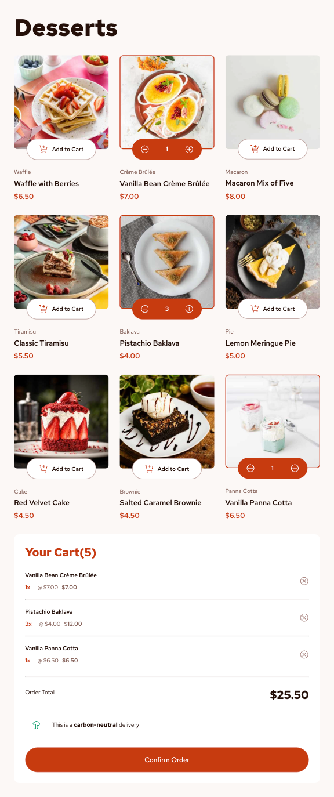

# Frontend Mentor - Product list with cart solution

This is a solution to the [Product list with cart challenge on Frontend Mentor](https://www.frontendmentor.io/challenges/product-list-with-cart-5MmqLVAp_d). Frontend Mentor challenges help you improve your coding skills by building realistic projects.

## Table of contents

- [Overview](#overview)
  - [The challenge](#the-challenge)
  - [Screenshot](#screenshot)
  - [Links](#links)
- [My process](#my-process)
  - [Built with](#built-with)
  - [What I learned](#what-i-learned)
- [Author](#author)

## Overview

### The challenge

Users should be able to:

- Add items to the cart and remove them
- Increase/decrease the number of items in the cart
- See an order confirmation modal when they click "Confirm Order"
- Reset their selections when they click "Start New Order"
- View the optimal layout for the interface depending on their device's screen size
- See hover and focus states for all interactive elements on the page

### Screenshot

**Mobile**

&nbsp;&nbsp;&nbsp;&nbsp;&nbsp;&nbsp;&nbsp;&nbsp;&nbsp;&nbsp;


**Tablet**

&nbsp;&nbsp;&nbsp;&nbsp;&nbsp;&nbsp;&nbsp;&nbsp;&nbsp;&nbsp;


**Desktop**

&nbsp;&nbsp;&nbsp;&nbsp;&nbsp;&nbsp;&nbsp;&nbsp;&nbsp;&nbsp;


### Links

- Solution URL: https://github.com/hatran-hattt/frontendmentor/tree/master/junior/product-list-with-cart
- Live Site URL: https://hatran-hattt.github.io/frontendmentor/junior/product-list-with-cart/dist/index.html

## My process

### Built with

- Semantic HTML5 markup
- CSS custom properties
- CSS Grid, Flexbox
- Mobile-first workflow
- Sass (CSS extension language)
- React.js

### What I learned

I've learned some CSS/JS tips throughout this challenge

#### 1. React.js

1.1. Use Immer library to update object in state

1.2. Manage component lifecycle using `useEffect` hook

- Mounting: The component is being created and inserted into the DOM for the first time.
  The code inside a useEffect hook runs after the initial render. If you provide an empty dependency array ([]), the effect will only run once after the component mounts
  ```
    useEffect(() => {
      // This code runs only once after the component mounts.
      // Perfect for fetching data, setting up event listeners, etc.
      console.log('Component has mounted!');
    }, []); // Empty dependency array means it runs once
  ```
- Updating: The component is being re-rendered because its state or props have changed.
  The code inside a useEffect hook runs after every render where one of its dependencies has changed.
  ```
    useEffect(() => {
      // This code runs after the component mounts AND whenever `count` changes.
      console.log(`Count has updated to ${count}`);
    }, [count]); // Dependency array with `count`
  ```
- Unmounting: The component is being removed from the DOM.
  The useEffect hook can return an optional "cleanup" function. This function runs just before the component unmounts.

  ```
    useEffect(() => {
      const timerId = setInterval(() => {
        // ... some logic
      }, 1000);

      // The returned function is the cleanup function
      return () => {
        // This code runs when the component is about to unmount.
        // It's used to clean up resources, clear timers, etc.
        clearInterval(timerId);
        console.log('Component is unmounting!');
      };
    }, []);
  ```

#### 2. CSS tips

- Modal: overlayer, scrollable

  ```
  .modal-overlay {
    /* Position the overlay over the entire screen */
    position: fixed;
    top: 0;
    left: 0;
    right: 0;
    bottom: 0;
  }

  .modal-container {
    max-height: 90vh; /* This is the key: modal will not exceed 90% of viewport height */
  }

  .modal-content-scrollable {
    flex-grow: 1; /* Allows this section to take up all available vertical space */
    overflow-y: auto; /* THIS IS THE MOST IMPORTANT PROPERTY */
  }
  ```

## Author

- Frontend Mentor - [@hatran-hattt](https://www.frontendmentor.io/profile/hatran-hattt)
