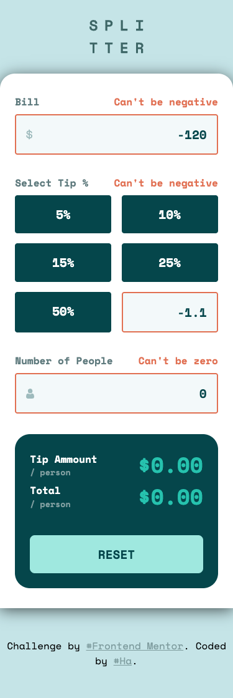
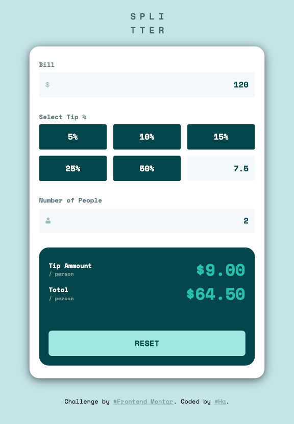
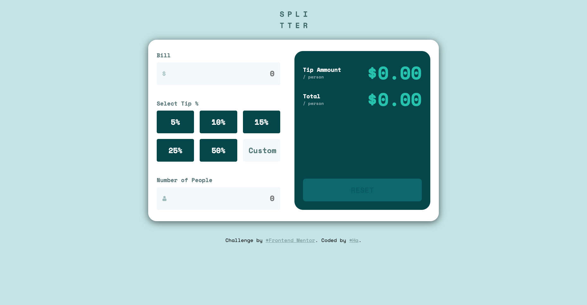

# Frontend Mentor - Tip calculator app solution

This is a solution to the [Tip calculator app challenge on Frontend Mentor](https://www.frontendmentor.io/challenges/tip-calculator-app-ugJNGbJUX). Frontend Mentor challenges help you improve your coding skills by building realistic projects.

## Table of contents

- [Overview](#overview)
  - [The challenge](#the-challenge)
  - [Screenshot](#screenshot)
  - [Links](#links)
- [My process](#my-process)
  - [Built with](#built-with)
  - [What I learned](#what-i-learned)
- [Author](#author)

## Overview

### The challenge

Users should be able to:

- View the optimal layout for the app depending on their device's screen size
- See hover states for all interactive elements on the page
- Calculate the correct tip and total cost of the bill per person

### Screenshot

**Mobile**

&nbsp;&nbsp;&nbsp;&nbsp;&nbsp;&nbsp;&nbsp;&nbsp;&nbsp;&nbsp;


**Tablet**

&nbsp;&nbsp;&nbsp;&nbsp;&nbsp;&nbsp;&nbsp;&nbsp;&nbsp;&nbsp;


**Desktop**

&nbsp;&nbsp;&nbsp;&nbsp;&nbsp;&nbsp;&nbsp;&nbsp;&nbsp;&nbsp;


### Links

- Solution URL: https://github.com/hatran-hattt/frontendmentor/tree/master/newbie/meet-landing-page
- Live Site URL: https://hatran-hattt.github.io/frontendmentor/newbie/meet-landing-page/index.html

## My process

### Built with

- Semantic HTML5 markup
- CSS custom properties
- CSS Grid, Flexbox
- Mobile-first workflow
- Sass (CSS extension language)

### What I learned

I've learned some CSS properties throughout this challenge

- Aligning items/tracks along the main(flexbox)/inline(grid) axis

  - `justify-content` (applies to **flexbox/grid** containers): aligns `items (or tracks)` and distributes extra space within the container.
  - `justify-items` (applies to **grid** containers): aligns the `content` of each individual grid item `within its cell`
    > `justify-self` (applies to **grid** items): aligns the content of a `single` grid item within its cell

- Applying a background image with a color layer

  ```
  {
    background-image:
      linear-gradient(to right, rgba(var(--color-bg-footer) ,0.75), rgba(#4D96A9,0.75)), /* Top layer: semi-transparent gradient */
      url('../assets/mobile/image-footer.jpg'); /* Bottom layer: actual image */
    background-repeat: no-repeat;
    background-size: cover; // Scales the image as large as possible without stretching it (clipped)
  }
  ```

- `Container-type` might affect an element's sizing, if a `shink-to-fit` width occurs, then an explicit width might be needed
  ```
  .container {
    container-type: inline-size;
    width: 100%;
  }
  ```
- Tip for centering block-level item horizontally: `margin: auto;`

## Author

- Frontend Mentor - [@hatran-hattt](https://www.frontendmentor.io/profile/hatran-hattt)
