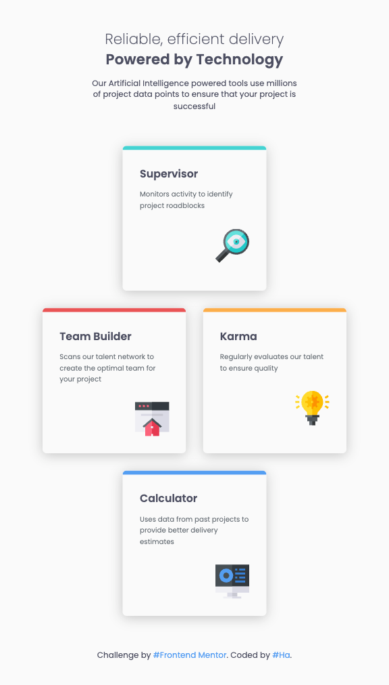
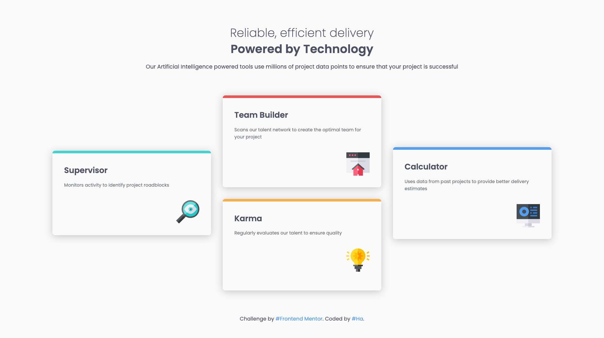

# Frontend Mentor - Four card feature section solution

This is a solution to the [Four card feature section challenge on Frontend Mentor](https://www.frontendmentor.io/challenges/four-card-feature-section-weK1eFYK). Frontend Mentor challenges help you improve your coding skills by building realistic projects.

## Table of contents

- [Overview](#overview)
  - [The challenge](#the-challenge)
  - [Screenshot](#screenshot)
  - [Links](#links)
- [My process](#my-process)
  - [Built with](#built-with)
  - [What I learned](#what-i-learned)
- [Author](#author)

## Overview

### The challenge

Users should be able to:

- View the optimal layout for the site depending on their device's screen size

### Screenshot

**Mobile**

&nbsp;&nbsp;&nbsp;&nbsp;&nbsp;&nbsp;&nbsp;&nbsp;&nbsp;&nbsp;


**Tablet**

&nbsp;&nbsp;&nbsp;&nbsp;&nbsp;&nbsp;&nbsp;&nbsp;&nbsp;&nbsp;


**Desktop**

&nbsp;&nbsp;&nbsp;&nbsp;&nbsp;&nbsp;&nbsp;&nbsp;&nbsp;&nbsp;


### Links

- Solution URL: https://github.com/hatran-hattt/frontendmentor/tree/master/newbie/four-card-feature
- Live Site URL: https://hatran-hattt.github.io/frontendmentor/newbie/four-card-feature/index.html

## My process

### Built with

- Semantic HTML5 markup
- CSS custom properties
- CSS Grid, Flexbox
- Responsive image
- Mobile-first workflow
- Sass (CSS extension language)

### What I learned

#### 1. Generate `fluid type scales, space scales` CSS utility classes using [Utopia](https://utopia.fyi/)

**About:** Utopia is an online tool that helps us apply fluid font size, fluid spacing when creating responsive web UI.

**How to use:** We input values based on designs, then Utopia will hep us generate CSS Custom Properties to use in our element style (Ex: font-size, margin, padding, gap, ...).

**Example:** For Type scales generating function, we need to input _font size_ at _min/max screen size_, scale rate.

**Note:**  
Ways to Import SASS lib utopia-core-scss

- Use NPM
- Direct Download & Manual Inclusion: Simpler for very small projects or if you just want to quickly test something. It keeps all your project's code self-contained.
- Sass Compiler with Load Paths:
  - Better for slightly larger projects where you manage dependencies outside of node_modules or want to keep external libraries separate from your core source. This is also how build tools like Webpack/Vite typically handle Sass imports from node_modules in the background.
  - When you run your Sass compiler, you'll pass an option to add libs/utopia-core-scss/src (or wherever you put the files) as a load path
    > sass --load-path=../../libs/utopia-core-scss/src --watch styles:dist

#### 2. Generate CSS Custom Properties & Utility Classes for Colors using SASS (Support theming)

**The main strategy will be:**

- Define all themes as a nested Sass map.

- Generate CSS Custom Properties for each theme under a specific html[data-theme='{theme-name}'] selector.

- Handle prefers-color-scheme as a fallback for the 'dark' theme when no explicit data-theme is set.

#### 3. CUBE CSS - CSS Methodology (thinking and organisational)

**Principles:**

The overarching principle of CUBE CSS is `simplicity`. There’s a lot of benefits to `letting the right tools do their job without any intervention`.

The `browser is hinted, rather micro-managed` to do what it knows best in the context that it finds itself in.

By using CSS for what it is good for, we assign `most of the style rules at a higher level`

CUBE CSS is completely tool agnostic because it is more of a `thinking and organisational methodology`, rather than a tooling methodology. As long as the output is CSS, it’s all good.

#### 4. Semantic naming for design tokens

**Example**

```
    // Properties
    --color-primary: Your main brand color.

    --color-secondary: A complementary brand color.

    --color-accent: A color used for highlighting or interactive elements.

    --color-text: Default text color.

    --color-text-light: Lighter text color (e.g., for disabled states).

    --color-background: Default background color.

    --color-background-alt: Alternate background color.

    --color-border: Default border color.

    --color-success: Green for success messages.

    --color-warning: Yellow/orange for warning messages.

    --color-error: Red for error messages.

    --color-info: Blue for informational messages.
```

```
    // Utilities

    text-primary: Sets text color to the primary theme color.

    bg-success: Sets background color to the success theme color.

    border-warning: Sets border color to the warning theme color.
```

## Author

- Frontend Mentor - [@hatran-hattt](https://www.frontendmentor.io/profile/hatran-hattt)
