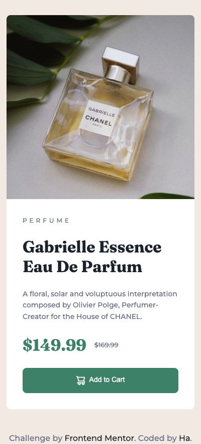
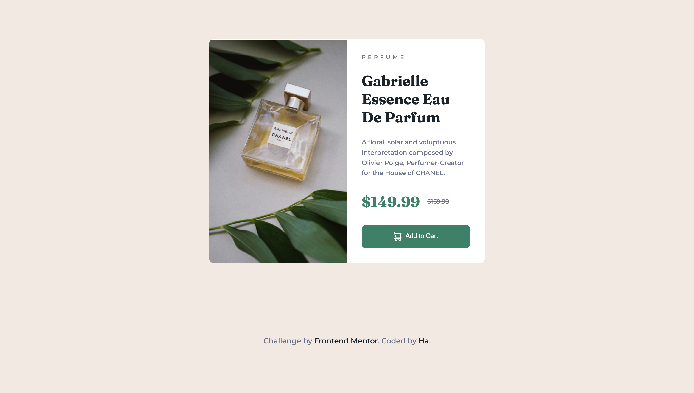

# Frontend Mentor - Product preview card component solution

This is a solution to the [Product preview card component challenge on Frontend Mentor](https://www.frontendmentor.io/challenges/product-preview-card-component-GO7UmttRfa). Frontend Mentor challenges help you improve your coding skills by building realistic projects.

## Table of contents

- [Overview](#overview)
  - [The challenge](#the-challenge)
  - [Screenshot](#screenshot)
  - [Links](#links)
- [My process](#my-process)
  - [Built with](#built-with)
  - [What I learned](#what-i-learned)
- [Author](#author)

## Overview

### The challenge

Users should be able to:

- View the optimal layout depending on their device's screen size
- See hover and focus states for interactive elements

### Screenshot





### Links

- Solution URL: https://github.com/hatran-hattt/frontendmentor/tree/master/newbie/product-preview-card
- Live Site URL: https://hatran-hattt.github.io/frontendmentor/newbie/product-preview-card/index.html

## My process

### Built with

- Semantic HTML5 markup
- CSS custom properties
- CSS Grid, Flexbox
- Responsive image
- Mobile-first workflow
- Sass (CSS extension language)

### What I learned

#### 1. Accessibility related

- aria-hidden="true" is an ARIA (Accessible Rich Internet Applications) attribute that is used to hide an element and all of its descendant elements from the accessibility API, meaning screen readers will ignore them
  The primary purpose of aria-hidden="true" is to prevent duplicate or redundant content from being announced by screen readers, thus improving the user experience for assistive technology users.

  > Ex: use for icon imagge

#### 2. Responsive design: responsive layouts

- Layouts:

  - Macro layout: Design page layouts.
    > Using: `media queries`, `rules`
  - Micro layout: Build flexible components that can be placed anywhere
    > Using: `container queries`, `rules`

- Example using container queries

  > ```
  >   // Setting styles for Card when Container width > 599px
  >   @container (width > #{to-em(599)}) {
  >     .product-card {
  >       display: grid;
  >       grid-template-columns: 1fr 1fr;
  >     }
  >   }
  >
  >   // Card container
  >   .product-card-container {
  >     container-type: inline-size;
  >   }
  > ```

- Example using rules
  > Apply rules so that the cards themselves automatically take up the right amount of space.
  >
  > ```
  >  .cards {
  >    display: grid;
  >    grid-template-columns: repeat(auto-fill, minmax(15em, 1fr));
  >    grid-gap: 1em;
  >  }
  > ```

#### 3. Responsive design: responsive images

> Reference: https://web.dev/learn/design/responsive-images

- Constrain images:

  ```
    img {
      max-inline-size: 100%;  // prevent image from wider than container (if image's intrinsic width is greater than the parent's width, it will shrink to 100& of the parent's width)
      block-size: auto;       // the browser preserves the image's aspect ratio
      aspect-ratio: 2/1;      // the ratio of its width to its height (It's especially powerful when used with object-fit)
      object-fit: contain;    // The image is scaled down to fit completely within the content box, preserving its aspect ratio. If the aspect ratio of the image doesn't match the aspect ratio of the container (which you've forced to 2/1 with aspect-ratio), then there will be empty space (letterboxing or pillarboxing) within the container.
    }

    // You can change the position of the image crop using the object-position property. This adjusts the focus of the crop, so you can make sure the most important part of the image is still visible.
    object-fit: cover;
    object-position: top center;
  ```

  > Note:
  >
  > - `aspect-ratio`: this property allows you to define the desired width-to-height ratio of an element's box
  > - `object-fit`: this property specifies how the content of a replaced element (like img or video) should be resized to fit its container, while respecting its aspect-ratio (if set) and the dimensions of its content box.
  > - To make the image fill its container's width even if the container is wider than image size, you need to change `max-inline-size` to `inline-size`

- Deliver images

  - Hints for sizing: If you know your image's dimensions, always include width and height attributes
  - Hints for loading: whether to delay loading the image until it's in or near the viewport
    loading="lazy"
    loading="eager" -> reset for hero image (right at viewport), if site automatically applies loading="lazy"
  - Fetch piority: Only set fetchpriority="high" on an image if it's truly vital
  - Hints for preloading: TODO
  - Image decoding: TODO

- Responsive image with `srcset` atrribute:

  > (\*) browser choose from different-sized versions of the same image (same ratio)

  - The `srcset` attribute allows you to specify a list of image sources along with their intrinsic sizes or pixel densities to help the browser choose the most appropriate image for the current viewing context. It's a cornerstone of responsive image optimization.
  - The `src` attribute is a fallback for browsers that don't support srcset or if none of the srcset conditions are met. Always include src
  - Density Descriptors (x descriptor)

    > When to use: When the image's CSS size remains constant, but you want a sharper image on high-resolution screens.

    ```
      
    ```

  - Width Descriptors (w descriptor)
    > allowing the browser to pick an image based on the available space in the layout. It almost always pairs with the sizes attribute
    > When to use: When the image's display size varies significantly based on screen size or layout changes (e.g., fluid layouts, images in columns)
    ```
      
    ```

- Responsive image with `<picture>` element:
  > (\*) apply when change the image completely (horizontal -> vertical, ...). Switch between image formats, sizes, cropping
  ```
  <picture>
    <source srcset="full.jpg" media="(min-width: 75em)" width="1200" height="500">
    <source srcset="regular.jpg" media="(min-width: 50em)" width="800" height="400">
    
  </picture>
  ```

#### 4. Others:

- Focus style for button:
  - when use `:focus`: after click, button is in focus style
  - when use `:focus-visible`: after click, button is not in focus style (only in focus when using tab)
    > `:focus` vs `:focus-visible`: https://developer.mozilla.org/en-US/docs/Web/CSS/:focus-visible

## Author

- Frontend Mentor - [@hatran-hattt](https://www.frontendmentor.io/profile/hatran-hattt)
