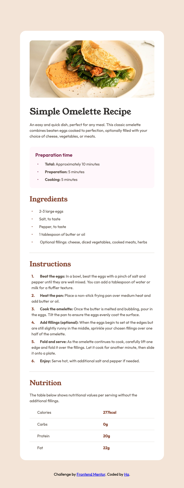

# Frontend Mentor - Recipe page solution

This is a solution to the [Recipe page challenge on Frontend Mentor](https://www.frontendmentor.io/challenges/recipe-page-KiTsR8QQKm). Frontend Mentor challenges help you improve your coding skills by building realistic projects.

## Table of contents

- [Overview](#overview)
  - [The challenge](#the-challenge)
  - [Screenshot](#screenshot)
  - [Links](#links)
- [My process](#my-process)
  - [Built with](#built-with)
  - [What I learned](#what-i-learned)
- [Author](#author)

## Overview

### The challenge

Your challenge is to build out this recipe page and get it looking as close to the design as possible.

You can use any tools you like to help you complete the challenge. So if you've got something you'd like to practice, feel free to give it a go.

### Screenshot



### Links

- Solution URL: https://github.com/hatran-hattt/frontendmentor/tree/master/newbie/recipe-page
- Live Site URL: https://hatran-hattt.github.io/frontendmentor/newbie/recipe-page/index.html

## My process

### Built with

- Semantic HTML5 markup
- CSS custom properties
- Flexbox

### What I learned

#### 1. Using semantic html5 element

- `<section>` is a thematic grouping of content, typically with a heading. (Ex: Chapters, Introduction, Contact information)
- `<article>` element specifies independent, self-contained content. An article should make sense on its own, and it should be possible to distribute it independently from the rest of the web site. (Ex: Blog posts, User comments, Product cards, ...)

  > Note: So, you will find HTML pages with `<section>` elements containing `<article>` elements, and `<article>` elements containing `<section>`elements.

- `<header>` element represents a container for introductory content or a set of navigational links.

  > Note: You can have several `<header>` elements in one HTML document. However, `<header>` cannot be placed within a `<footer>`, `<address>`or another `<header>` element.

- `<ul>`, `<ol>`: "Preparation time" and "Ingredients" are unordered lists, while "Instructions" is an ordered list, reflecting the sequential nature of steps.

- `<strong>`: Used for the bolded keywords within the list items (Total, Beat the eggs, etc.) to semantically emphasize them.

- `<table>`'s `<caption>`, `<thead>`, `<th>` elements define the column headers for accessibility.
  > Use css class sr-only (screen-reader-only class) to visually hide content on web page, while still keeping it accessible to screen readers and other assistive technologies.
  >
  > - Simple definition: `display: none;` or `visibility: hidden;`
  > - Standard and widely accepted sr-only class definition:
  >
  > ```
  > .sr-only {
  >   /* Visually hidden but accessible to screen readers */
  >   position: absolute;
  >   width: 1px;
  >   height: 1px;
  >   padding: 0;
  >   margin: -1px;
  >   overflow: hidden;
  >   clip: rect(0, 0, 0, 0);
  >   white-space: nowrap;
  >   border: 0;
  > }
  > ```

#### 2. Custom style for list (marker)

- Apply css properties on list element

  - list-style-position allows you to move your bullet point to either inside or outside the list-item's contents. (default: outside)
  - list-style-image allows you to replace your list's bullet points with images.
  - list-style-type which changes the bullet points to known style keywords, custom strings, emoji and more.

- Use pseudo class `li::marker` - adds the ability to change the color, size, and spacing of markers.

  > Note: `::marker` gives you far more control over marker styles than list-style-type, but it doesn't work with every CSS property. The following properties are allowed:
  >
  > `animation-\_
  > transition-\_
  > color
  > direction
  > font-\*
  > content
  > unicode-bidi
  > white-space

- For full control, use a custom marker with `li::before` (remember to reset defaul list style `ul/ol:list-style: none;`)

  - Example: unorder list

    > ```
    > .recipe-section__list > li::before {
    >        content: "•";
    >        display: inline-block;
    >        color: ...
    >        width: ... /* Controls space */
    >        }
    > ```

  - Example: order list (use custom-counter for numbering)
    > ```
    > .recipe-instructions\_\_list {
    > counter-reset: custom-counter;
    > }
    > .recipe-instructions**list > li {
    > counter-increment: custom-counter;
    > }
    > .recipe-instructions**list > li::before {
    > content: counter(custom-counter) ".";
    > }
    > ```

#### 3. Style for table

> Reference: https://estelle.github.io/CSS/tables/#slide1

- Setting gap between cells: table's border-collapse (collapse, ...)
- Setting border: td's border

#### 4. Give inline element more space

> display: inline-block; // ex: give space arround span

#### 5. Controlling the alignment (directly under text) of text in a list item when it wraps to a new line (`hanging indent`)

- Default list's style (list-style-position: outside): already directly under text
- Case customizing list's style

  - Using Flexbox (Most Recommended for Modern Layouts) for `<li>`
    > use when item contains only marker & 1 content
  - Using text-indent (Traditional, Less Flexible)
    > This method involves a negative text-indent on the `<li>` and a positive padding-left to push the first line over.

#### 6. Sass - CSS extension language

- Command line tool for compile Sass into CSS
  - Install on Mac OS X or Linux (Homebrew)
    > brew install sass/sass/sass
  - Compile
    > - build
    >   > sass app/sass:public/stylesheets
    > - watch & auto build
    >   > sass --watch app/sass:public/stylesheets
- Features

  > Reference: https://sass-lang.com/guide/

  - Variables (use $ symbol)

    > Comapre: Sass Variables($) vs CSS Custom Properties(--)
    >
    > - ($):
    >   - Pros:
    >     - Good for `complex programatically calculation`
    >     - Since they are compiled to standard CSS, they are `compatible with all browsers` that support CSS
    >   - Cons:
    >     - Static (Compile-Time Only): Cannot change values dynamically using JS in the browser
    >     - Browser inspection is not possible (only compiled hardcoded values are visible, not variable names).
    > - (--):
    >   Pros, Cons: ($)'s Cons, Pros

    > The most powerful and flexible approach is to use Sass variables to define your foundational (primitive) tokens and generate your CSS Custom Properties, which your components then consume.
    >
    > This approach offers:
    >
    > 1. Sass's Build-Time Power: Use Sass for loops, calculations, and functions to programmatically define your design system (e.g., generating 10 shades of blue, a full spacing scale, or responsive font sizes).
    > 2. CSS Custom Properties' Runtime Flexibility: Your actual components consume the CSS Custom Properties, making them dynamic, inspectable, and subject to the CSS cascade.

  - Nesting: let you nest your CSS selectors in a way that follows the same visual hierarchy of your HTML
  - Partials
    - These are Sass files that start with an underscore.
    - Underscore tells Sass that these files are "partials" and should not be compiled into standalone .css files. They are meant to be imported (or more accurately, "used" or "forwarded") into other Sass files.
  - Module System

    > This is the modern replacement for the deprecated @import rule

    - @use: For consuming (using) styles, variables, mixins, and functions from other Sass files.

      > Imports a partial into the current file. Its contents are available under a namespace (by default, the filename)

      ```
        @use "../variables" as var;
        ...: var.$variable-name

        or
        @use "../variables" as *; // It's generally best reserved for modules that are truly global (like a variables or functions utility file) or for small projects.
        ...: $variable-name
      ```

    - @forward: For making modules consumable by other modules, effectively re-exporting members.
      > Allows you to re-export members from one partial through another. Useful for creating entry points for collections of partials (e.g., an \_index.scss file that forwards all components in a folder)

  - Mixins

    ```
      @mixin theme($theme: DarkGray) {
        background: $theme;
        box-shadow: 0 0 1px rgba($theme, .25);
        color: #fff;
      }

      .info {
        @include theme;
      }
      .alert {
        @include theme($theme: DarkRed);
      }
    ```

  - Extend/Inheritance

    ```
      // A placeholder class is a special type of class that only prints when it is extended
      %message-shared
      border: 1px solid #ccc
      padding: 10px
      color: #333

      .message
        @extend %message-shared

      .success
        @extend %message-shared
        border-color: green
    ```

  - Functions
    ```
      @function to-rem($px-value) {
        @return ($px-value / $base-font-size) * 1rem;
      }
    ```
  - The #{} syntax in Sass is called interpolation.

    > Its purpose is to embed SassScript (Sass variables, expressions, function calls, or even plain strings) directly into parts of your CSS that would otherwise be treated as literal text or where Sass wouldn't automatically expand them.

    ```
    :root {
      /* Colors */
      --color-brand-primary: #{primitives.$color-blue-600};
    ```

    ```
      $component-name: 'button';
      .#{component-name} { /* Becomes .button */
        // ...
      }
    ```

- Structure:
  > 7-1 pattern
  > Reference: https://sass-guidelin.es/#architecture

#### 7. Fluid Typography prefered caculation: TODO

## Author

- Frontend Mentor - [@hatran-hattt](https://www.frontendmentor.io/profile/hatran-hattt)
