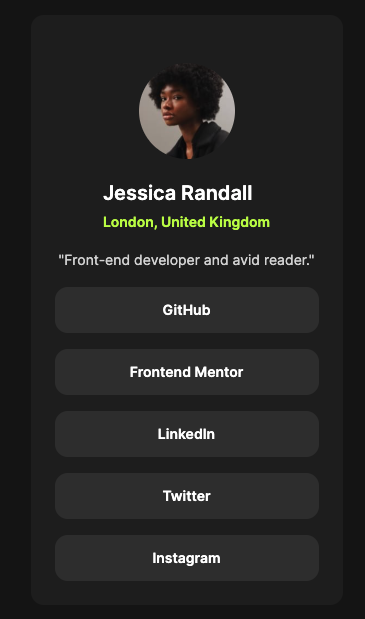

# Frontend Mentor - Social links profile solution

This is a solution to the [Social links profile challenge on Frontend Mentor](https://www.frontendmentor.io/challenges/social-links-profile-UG32l9m6dQ). Frontend Mentor challenges help you improve your coding skills by building realistic projects.

## Table of contents

- [Overview](#overview)
  - [The challenge](#the-challenge)
  - [Screenshot](#screenshot)
  - [Links](#links)
- [My process](#my-process)
  - [Built with](#built-with)
  - [What I learned](#what-i-learned)
- [Author](#author)

## Overview

### The challenge

Users should be able to:

- See hover and focus states for all interactive elements on the page

### Screenshot



### Links

- Solution URL: https://github.com/hatran-hattt/frontendmentor/tree/master/newbie/social-links-profile
- Live Site URL: https://hatran-hattt.github.io/frontendmentor/newbie/social-links-profile/index.html

## My process

### Built with

- Semantic HTML5 markup
- CSS custom properties
- Flexbox

### What I learned

Styling \<a> tag to look like a button.

    ```
    .profile-card__social-link {
        /* Step1. Reset <a>'s style */
        color: inherit;
        text-decoration: none;
        background: none;
        outline: none;
        border: none;
        font: inherit;
        padding: 0;
        margin: 0;

        /* Step2. Make <a> look like button */
        display: block;
        text-align: center;

        /* Other styling */
        padding-block: var(--spacing-200);
        border-radius: 0.8rem;
        background-color: var(--color-grey-700);
    }
    ```

## Author

- Frontend Mentor - [@hatran-hattt](https://www.frontendmentor.io/profile/hatran-hattt)
