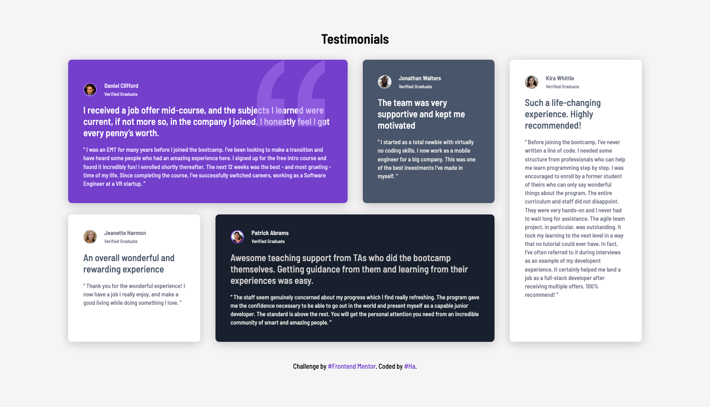

# Frontend Mentor - Testimonials grid section solution

This is a solution to the [Testimonials grid section challenge on Frontend Mentor](https://www.frontendmentor.io/challenges/testimonials-grid-section-Nnw6J7Un7). Frontend Mentor challenges help you improve your coding skills by building realistic projects.

## Table of contents

- [Overview](#overview)
  - [The challenge](#the-challenge)
  - [Screenshot](#screenshot)
  - [Links](#links)
- [My process](#my-process)
  - [Built with](#built-with)
  - [What I learned](#what-i-learned)
- [Author](#author)

## Overview

### The challenge

Users should be able to:

- View the optimal layout for the site depending on their device's screen size

### Screenshot

**Mobile**

&nbsp;&nbsp;&nbsp;&nbsp;&nbsp;&nbsp;&nbsp;&nbsp;&nbsp;&nbsp;

**Tablet**

&nbsp;&nbsp;&nbsp;&nbsp;&nbsp;&nbsp;&nbsp;&nbsp;&nbsp;&nbsp;

**Desktop**

&nbsp;&nbsp;&nbsp;&nbsp;&nbsp;&nbsp;&nbsp;&nbsp;&nbsp;&nbsp;

### Links

- Solution URL: https://github.com/hatran-hattt/frontendmentor/tree/master/newbie/testimonials-grid
- Live Site URL: https://hatran-hattt.github.io/frontendmentor/newbie/testimonials-grid/index.html

## My process

### Built with

- Semantic HTML5 markup
- CSS custom properties
- CSS Grid, Flexbox, Positioning using `position` property
- Mobile-first workflow
- Sass (CSS extension language)

### What I learned

#### 1. More about Grid

**1.1. Tracks Sizing (space between 2 grid line)**

- [Intrinsic sizing keywords](https://web.dev/learn/css/grid?continue=https%3A%2F%2Fweb.dev%2Flearn%2Fcss%23article-https%3A%2F%2Fweb.dev%2Flearn%2Fcss%2Fgrid#intrinsic_sizing_keywords):

  - auto
  - min-content: as narrow as the longest word in the track.
  - max-content: The track will become as wide enough for all of the content to display in one long unbroken string. This might cause overflows as the string won't wrap.
  - fit-content(): once the track reaches the size that you pass into the function, the content starts to wrap (<= value passed> )

- `fr` unit
- `minmax()` function

  > minmax(100px, 1fr)
  > minmax(auto, 1fr): Grid looks at the intrinsic size of the content, then distributes available space after giving the content enough room
  > minmax(0, 1fr): TODO

- `auto-fill` & `auto-fit` (used within the repeat())
  Use when you don't want to specify the number of column tracks, but instead want to create as many as will fit in your container.
  They are incredibly useful for creating flexible, responsive grids **without media queries**.

  - repeat(auto-fill, minmax(150px, 1fr));

    `auto-fill` creates as many tracks as possible to fill the available space, `even if those tracks are empty`. It prioritizes filling the container with potential slots.

    it will leave empty `ghost` or `invisible` tracks (column/row gaps) to fill the remaining space

    ex: 600px & 2 items -> 2 items will occupy the first two, and the last two columns will be empty.

  - repeat(auto-fit, minmax(150px, 1fr));

    `auto-fit` works similarly to auto-fill but then `collapses any empty tracks` that are created. It prioritizes `fitting the content` rather than filling the entire container with potential slots.

    This causes the actual occupied tracks to expand and take up the remaining available space, as if those collapsed tracks never existed.

    ex: 600px & 2 items -> collapse the two empty columns. The 2 actual items will then expand to fill the entire 600px, each taking 300px.

**1.2. Auto placement when col/row is not specified**

- The **default behavior** of grid layout is to place items along the **rows**.
- The items will be placed according to the order they are in the source, or any modification with the `order` property
- To place items along the `columns` use `grid-auto-flow: column`
- `grid-column-end: span 2;` and `grid-column: auto / span 2;` is the same
- An auto-placed layout with some items spanning multiple tracks may result in a grid with some unfilled cells.
  > `grid-auto-flow: dense` -> grid will take items later in the layout and use them to fill gaps

#### 2. CSS layout mechanisms - [Positioning](https://web.dev/learn/css/layout#positioning)

The `position` property changes how an element behaves in the normal flow of the document, and how it relates to other elements.  
The available options are `relative`, `absolute`, `fixed` and `sticky` with the **default value being `static`**.

- When an element has `position: static` (which is the default value for all HTML elements), the top, bottom, left, right, and z-index properties have `no effect` on its layout. The element's position is determined solely by its place in the `normal document flow` and other layout properties (like margin, padding, display, flexbox, grid, etc.).
- when position is set to anything other than static (`relative, absolute, fixed, or sticky`), the top, bottom, left, right, and z-index properties will `affect` the element's position.
  - `position: relative;`: The element remains in the `normal document flow`, occupying its original space. top, bottom, left, right then `shift the element relative to its original position`. This creates an offset, but the space it originally occupied remains empty, affecting subsequent elements in the flow.
  - `position: absolute;`: The element is `removed from the normal document flow` (The space it originally occupied collapses as if the element wasn't there). top, bottom, left, right then position it `relative to its **nearest positioned ancestor**` (an ancestor with position other than static). If no such ancestor exists, it's positioned relative to the initial containing block (usually the viewport).
  - `position: fixed;`: The element is `removed from the normal document flow` (The space it originally occupied collapses as if the element wasn't there). top, bottom, left, right then position it `relative to the **viewport**`. It stays in that position even when the user scrolls.
  - `position: sticky;`: This is a `hybrid`. It's `initially positioned according to the normal flow`. However, when the user scrolls and the element's container (or the viewport, depending on its specific behavior) reaches a certain scroll threshold, the element becomes `"stuck"` (like position: fixed) at the position defined by top, bottom, left, right. When it scrolls back past that threshold, it reverts to its normal flow position.
    (Remains in the normal document flow and preserves its original space. It only temporarily "sticks" to the viewport based on scroll position, and then reverts to its flow position.)
- Properties control an element's offset and stacking order: top, left, right, bottom, z-index

## Author

- Frontend Mentor - [@hatran-hattt](https://www.frontendmentor.io/profile/hatran-hattt)
